# EvidenceFlow-UT - 面向Universal Transformer的逐层监督训练方法

## 研究背景

Universal Transformer (UT) 通过循环共享层机制实现了自适应计算深度，但面临一个核心挑战：**深度编码能力受限**——循环层往往学习到相似的表示，无法充分利用深度带来的表达能力提升。

现有解决方案如MoEUT等，主要从架构设计角度优化（通过增大参数差异化），但缺乏对每层表示质量的显式监督。

本项目基于 **Universal Transformer (UT)** 架构，提出了一种**逐层监督损失（Layer-wise Supervision Loss, 即先验损失Loss_p）**，通过神经科学中的证据累积视角，为UT的深度编码提供了一种新的损失引导路径。

## 核心创新：逐层监督损失（Loss_p）

本研究从神经科学中的**漂移扩散模型（Drift Diffusion Model）** 获得启发。该模型认为，人脑决策是证据持续累积直至超过阈值的过程。基于此，EvidenceFlow-UT提出一个全新的视角：将Transformer的隐藏层视为**证据流动的路径**，每一层的输出`F_i`是当前累积的证据状态；最终正确答案的embedding`T`则是"目标证据状态"。训练的目标是让证据在各层之间逐步流动并逼近目标状态。

### 逐层监督损失（Layer-wise Per-layer Loss）

```
Loss_p = Σ_i ||F_i - T||²
```

这一设计具有以下独特优势：

1. **无需额外参数**：传统深度监督（Deeply-Supervised Nets）需要在每层添加独立的分类器（参数规模为`d_model × vocab_size`），而EvidenceFlow-UT直接在特征空间对齐，不增加任何推理参数。

2. **计算开销小**：每层仅需`d_model`维的向量运算，远小于传统逐层监督的`d_model × vocab_size`矩阵乘法。

3. **可解释性强**：Loss_p的值可直接反映各层证据池与目标状态的距离，为模型内部状态提供了可观测的量化指标。

4. **理论基础坚实**：证据累积框架为每一层赋予了明确的决策论意义，与神经科学形成呼应。

## 项目特性

- **EvidenceFlow-UT**: 基于证据流动视角的逐层监督训练方法
- **Layer-wise Supervision Loss (Loss_p)**: 通过证据累积约束引导深度编码
- **UT架构**: 使用共享的 ModelBlock 循环应用（Universal Transformer）
- **零推理开销**: 训练阶段仅增加少量计算，推理阶段完全透明
- **MLA (Multi-head Latent Attention)**: 低秩键值压缩机制，降低内存占用
- **MoE (Mixture of Experts)**: 混合专家架构，提升模型容量和效率
- **Warm-up Schedule**: 学习率预热机制，提高训练稳定性

## 模型配置

```json
{
  "vocab_size": 5000,
  "n_layer": 6,
  "n_head": 8,
  "d_model": 512,
  "d_c": 128,
  "d_r": 8,
  "hidden": 32,
  "other_experts": 384,
  "shared_experts": 24,
  "keep": 8,
  "ro_theta": 10000.0,
  "dropout": 0.1,
  "scale": 0.02,
  "alpha": 0.01
}
```

## 数据集信息

- **名称**：gongjy/minimind_dataset
- **来源链接**：https://www.modelscope.cn/datasets/gongjy/minimind_dataset/files
- **许可证**：Apache License 2.0

### 遵守原始许可证

本数据集的使用遵循 Apache License 2.0 的规定。
根据许可证要求，我们在此声明：

1. 我们保留了原始数据集中包含的所有版权、专利、商标及归属声明。
2. 本项目的根目录下附有 Apache License 2.0 的完整副本。

完整的许可证条款请参阅项目根目录下的 [LICENSE](./LICENSE) 文件，或访问：http://www.apache.org/licenses/LICENSE-2.0。

## 环境要求

- Python 3.x
- PyTorch 2.10.0
- CUDA 12.8

## 安装依赖

```bash
pip install -r requirements.txt
```

## 项目结构

```
EvidenceFlow-UT/
├── model/                 # 模型定义
│   └── tinyseek.py       # TinySeek模型实现
├── modules/              # 核心模块
│   ├── mla.py           # 多头潜在注意力
│   ├── moe.py           # 混合专家层
│   └── layers/          # 基础层组件
├── train_agent/          # 训练相关
│   └── pre_train_shared.py  # 预训练脚本
├── evaluate_agent/       # 评估相关
│   └── evaluate_function.py # 评估函数
├── dataset/              # 数据集
│   └── minimind_dataset/
├── docs/                 # 文档
│   ├── technical_report.txt  # 技术报告
│   └── figures/         # 实验图表
├── out/                  # 输出目录
├── train_shared.py       # 训练入口
├── evaluate.py           # 评估入口
├── plot.py              # 绘图脚本
└── shared_model_config.json  # 模型配置
```

## 使用方法

### 训练模型

```bash
python train_shared.py
```

主要训练参数：
- `max_epochs`: 最大训练轮数
- `batch_size`: 批次大小
- `init_lr`: 初始学习率
- `warmup_index`: 预热步数
- `NO_loss_p`: 是否使用逐层损失惩罚
- `accumulation_steps`: 梯度累积步数

### 评估模型

```bash
python evaluate.py
```

评估参数：
- `load_index`: 加载的模型检查点
- `repetition_penalty`: 重复惩罚系数
- `LoRA/SFT/Full`: 选择评估模式

### 绘制训练曲线

```bash
python plot.py
```

支持对数拟合来分析损失收敛趋势。

## 实验结果

### 消融实验对比（基于技术报告）

| 实验设置 | 完成步数 | 最终Loss | 最终困惑度 | 最终Loss_p | 状态 |
|---------|---------|---------|-----------|-----------|------|
| **Baseline (Full)** | 4710 | 2.47 | 7.77 | 0.11 | ✅ 稳定收敛 |
| w/o Warm-up | 525 | 5.63 | 27.11 | 2.03 | ❌ 训练震荡 |
| w/o Layer-wise Loss | 4191 | 16.89 | 120.04 | 12.02 | ❌ 模型坍塌 |

### 核心结论

**两个消融实验均因训练不稳定提前终止，且最终性能显著差于基线。**

#### 1. 实验状态

- **基线 (Full)**：顺利完成 **4710** 步训练。
- **w/o Warm-up**：严重不稳定，仅完成 **525** 步（约11%）即终止。
- **w/o layerwise_loss**：相对稳定但性能极差，完成 **4191** 步（约89%）后终止。

#### 2. 关键指标最终值对比

| 指标 | 基线 (Full) | w/o Warm-up | w/o layerwise_loss |
| :--- | :--- | :--- | :--- |
| **交叉熵损失 (Loss)** | **2.47** | **5.63** (↑128%) | **16.89** (↑585%) |
| **困惑度 (Perplexity)** | **7.77** | **27.11** (↑249%) | **120.04** (↑1445%) |
| **Lexp** | 30.12 | 29.90 (持平) | **8.59** (↓71%) |

#### 3. 根本原因分析

- **w/o Warm-up (无预热)**：**训练震荡严重**。其困惑度（PPL）的变异系数（CV）有 **12.57%** 的时间超过稳定阈值，远高于基线的2.06%，且学习率始终固定在最大值，导致早期步数就发生梯度爆炸。

- **w/o layerwise_loss (无逐层损失)**：**模型坍塌**。虽然损失曲线看似平稳（CV值极低），但交叉熵损失高达16.89，同时Lexp指标暴跌71%，表明模型输出分布被严重破坏，失去了表达能力。

#### 4. 结论

**Warm-up和Layer-wise Loss对于该模型的稳定训练均至关重要，缺一不可。**

### 与相关工作对比

| 工作 | 解决路径 | 核心机制 | 推理开销 | 可解释性 | 实验架构 |
|------|----------|----------|----------|----------|----------|
| MoEUT (NeurIPS 2024) | 参数差异化 | MoE专家分工 | 增加 | 低 | UT |
| Relaxed Recursive (ICLR 2025) | 参数差异化 | 层间LoRA | 增加 | 低 | UT |
| Deeply-Supervised Nets (ICML 2015) | 损失引导 | 每层分类器+交叉熵 | 无（训练后丢弃） | 中 | CNN/RNN |
| **EvidenceFlow-UT** | **损失引导** | **证据流动MSE对齐** | **零增加** | **高** | **UT (TinySeek)** |

### 训练曲线可视化

#### Baseline (Full) 训练过程

| **Loss收敛曲线** | **逐层监督损失** | **困惑度** |
|:----------------:|:----------------:|:----------:|
| 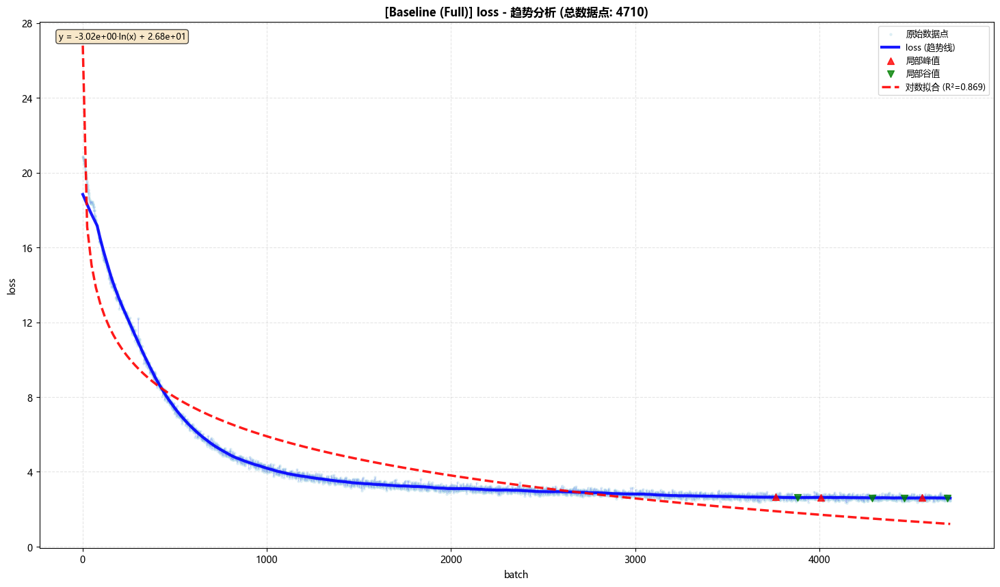 | 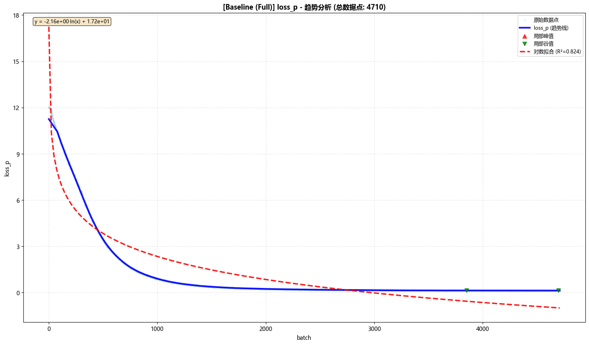 | 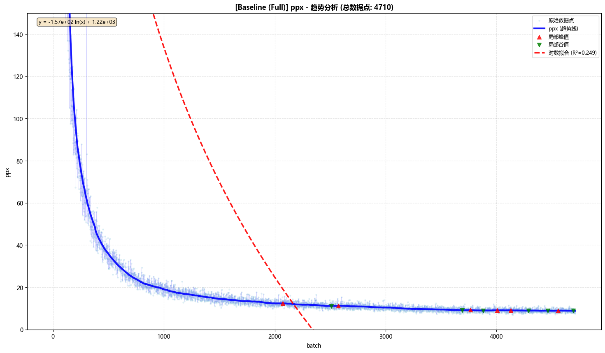 |

| **专家负载损失** | **学习率调度** |
|:--------------:|:-------------:|
| 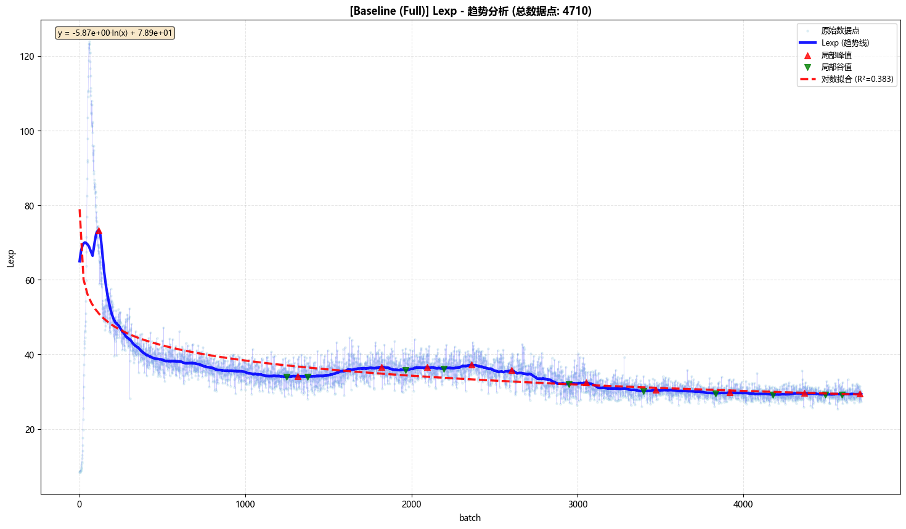 | 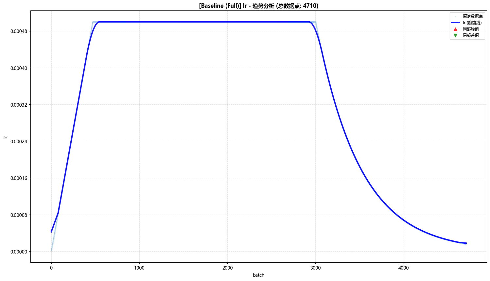 |

#### 消融实验对比

| **Loss对比** | **Loss_p对比** | **困惑度对比** |
|:------------:|:--------------:|:--------------:|
| 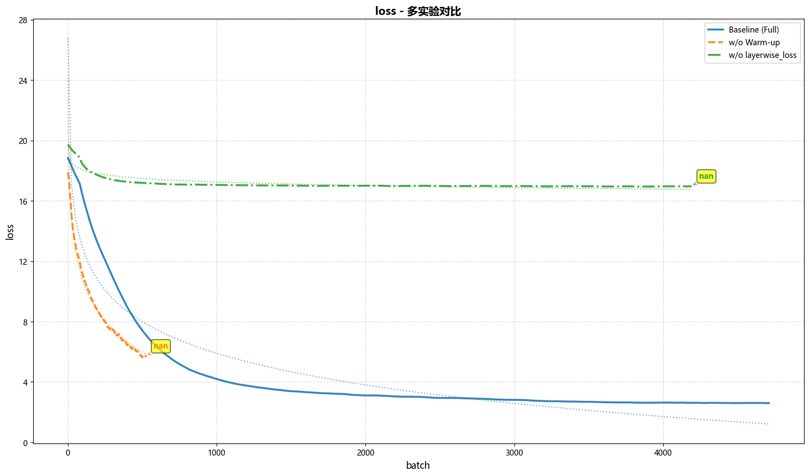 | 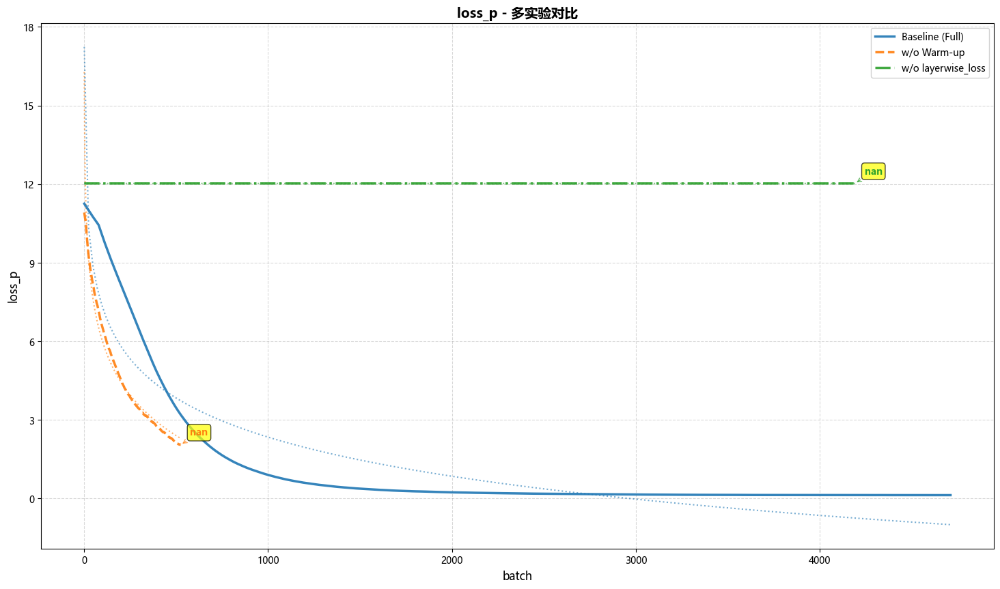 | 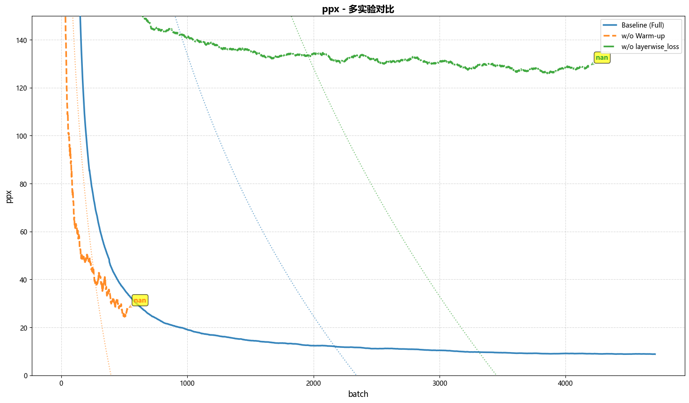 |

| **专家负载损失对比** | **学习率对比** | **变异系数对比** |
|:------------------:|:--------------:|:----------------:|
| 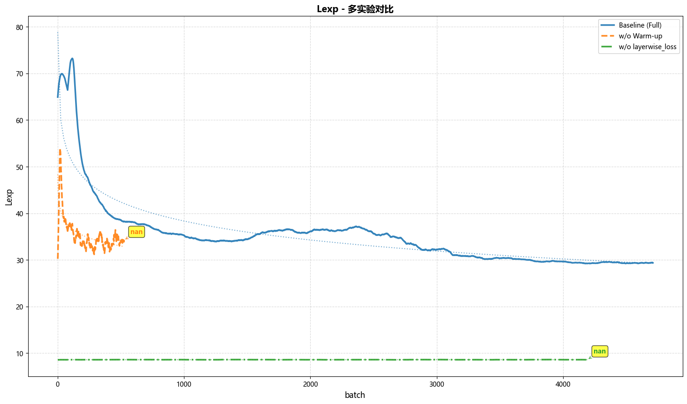 | 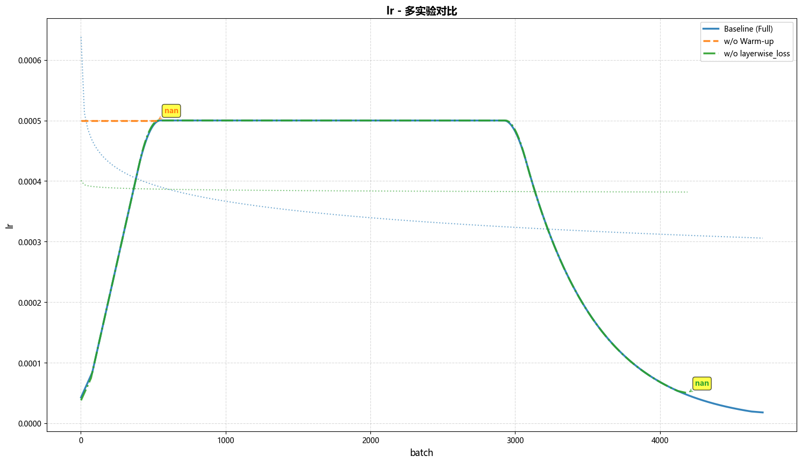 | 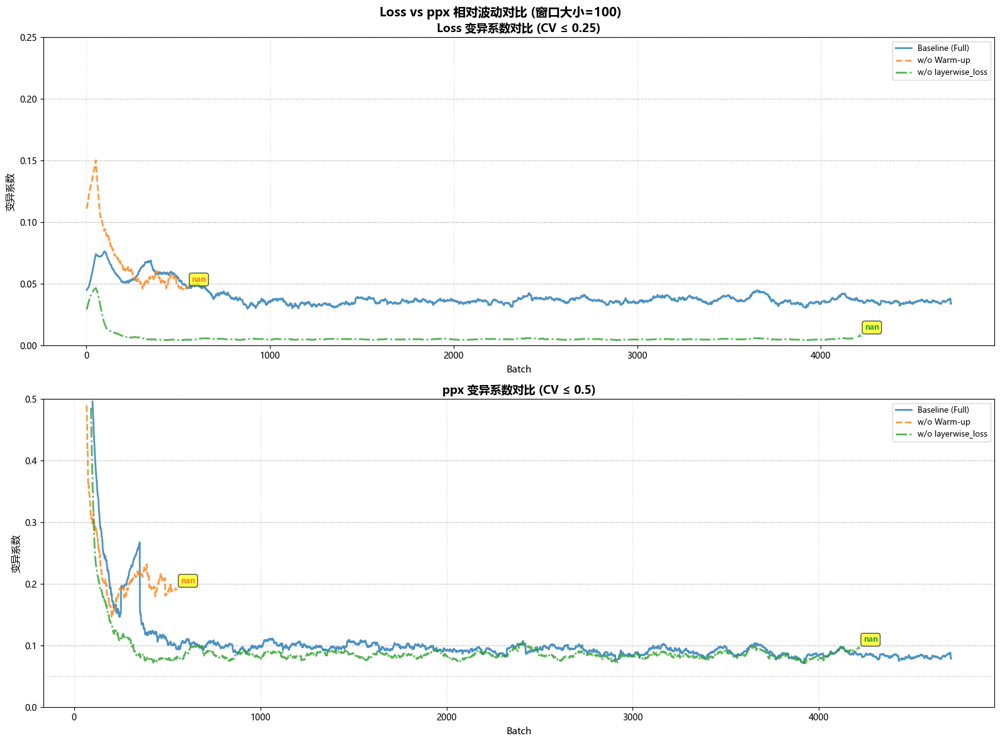 |

## 技术细节

### MLA (Multi-head Latent Attention)

采用低秩键值压缩：
- `d_c`: 压缩键/值的KV头维度 (128)
- `d_r`: 注意力头压缩率 (8)

通过矩阵分解减少KV缓存内存占用，提升推理效率。

### MoE (Mixture of Experts)

混合专家配置：
- `other_experts`: 其他专家数量 (384)
- `shared_experts`: 共享专家数量 (24)
- `keep`: 每次激活的专家数 (8)

实现稀疏激活，提升模型容量同时保持计算效率。

### Layer-wise Supervision Loss (Loss_p)

逐层监督损失设计（EvidenceFlow-UT核心）：
- **证据流动机制**：每层输出视为当前累积的证据状态，通过流动逐步逼近目标
- **目标对齐**：每层与正确答案embedding进行MSE对齐
- **无参监督**：直接在特征空间约束，不增加推理参数
- **可观测性**：Loss_p值直接反映证据流动与目标状态的逼近程度

### Warm-up Schedule

学习率预热策略：
- 预热步数：471步
- 峰值学习率：5e-4
- 作用：平稳启动训练，防止早期梯度爆炸

## 未来方向

本研究为UT训练优化提供了一条"损失引导"的探索路径。后续计划从三个方向深化探索：

1. **架构扩展**：将Loss_p应用于更多类型的Transformer架构（如标准Transformer、其他UT变体等），验证方法的泛化能力

2. **效率优化**：尝试稀疏监督策略，仅监督关键层，在保持收敛质量的同时优化训练效率

3. **可解释性深化**：引入目标掩码，逐层释放不同的特征目标，实现更细粒度的表示学习引导

## 研究价值总结

EvidenceFlow-UT在 **Universal Transformer (UT)** 架构上验证了逐层监督损失（Loss_p）的有效性——**以训练阶段的小幅开销，换取推理阶段的零额外负担与模型内部状态的可解释性**。这一发现为UT训练优化提供了新的损失引导路径（将深度编码从架构设计转为损失引导），也为神经科学启发下的AI模型设计提供了实践范例。

### 实验范围

**当前实验基于以下配置：**
- 架构：UT（TinySeek，共享同一个 ModelBlock 循环应用）
- 循环深度：6次
- 注意力：MLA（Multi-head Latent Attention）
- 前馈网络：MoE（Mixture of Experts）
- 数据集：MiniMind 预训练数据集
- 词汇量：5000

**尚未验证的范围：**
- 标准Transformer架构（非共享层）
- 其他UT变体
- 更大的模型规模
- 其他数据集和任务类型

### 方法优势

1. **轻量级**：无需修改模型结构，仅增加训练阶段计算开销
2. **零推理开销**：推理阶段完全透明，不影响部署效率
3. **可解释**：Loss_p值直接反映各层表示质量

## 许可证

本项目采用 Apache License 2.0 许可证。

完整的许可证条款请参阅项目根目录下的 [LICENSE](./LICENSE) 文件，或访问：http://www.apache.org/licenses/LICENSE-2.0。

### 数据集许可证

本项目使用的 gongjy/minimind_dataset 数据集同样遵循 Apache License 2.0 许可证。我们保留所有原始的版权、专利、商标及归属声明。

## 贡献

欢迎提交Issue和Pull Request！
